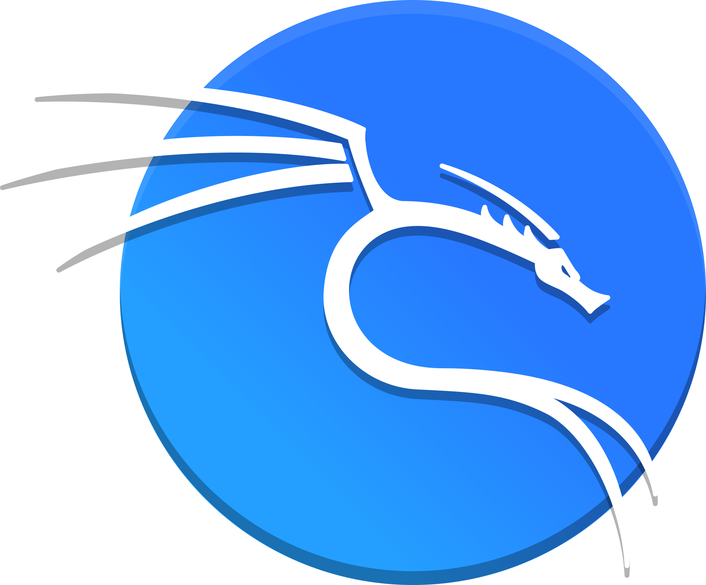

# Welcome to My GitHub

## About Me
I am a passionate software engineer adept at crafting E2E enterprise solutions across the vast technology ecosystem, encompassing web, mobile, and desktop environments. My expertise spans various industry domains, and I specialize in harnessing diverse technologies to bridge the gaps between platforms, fostering seamless user experiences and delivering impactful results.

---

## Tech Stack

**Operating Environments:**

  
  
  
  

**Languages:**

  
  
  
  
  
  
  
  

**Web Frameworks:**

  
  
  
  

**Libraries:**

  

**Application Servers:**

  
  

**Web Servers:**

  

**Databases:**

  
  
  

**Cloud Platforms:**
- Google Cloud
- AWS
- Digital Ocean

  
  
  
  

---

## Beyond the Code

Technology isn't my only muse. As an all-round artist, I express myself through:
- **Music:** Singing and rapping.
- **Visual Arts:** Painting, drawing, calligraphy, graffiti, and photography.

In essence, I am a techie with an artist's soul and an artist with an engineer's mind.

---

Thank you for visiting my GitHub! Feel free to explore my repositories and connect with me to collaborate or share ideas.

